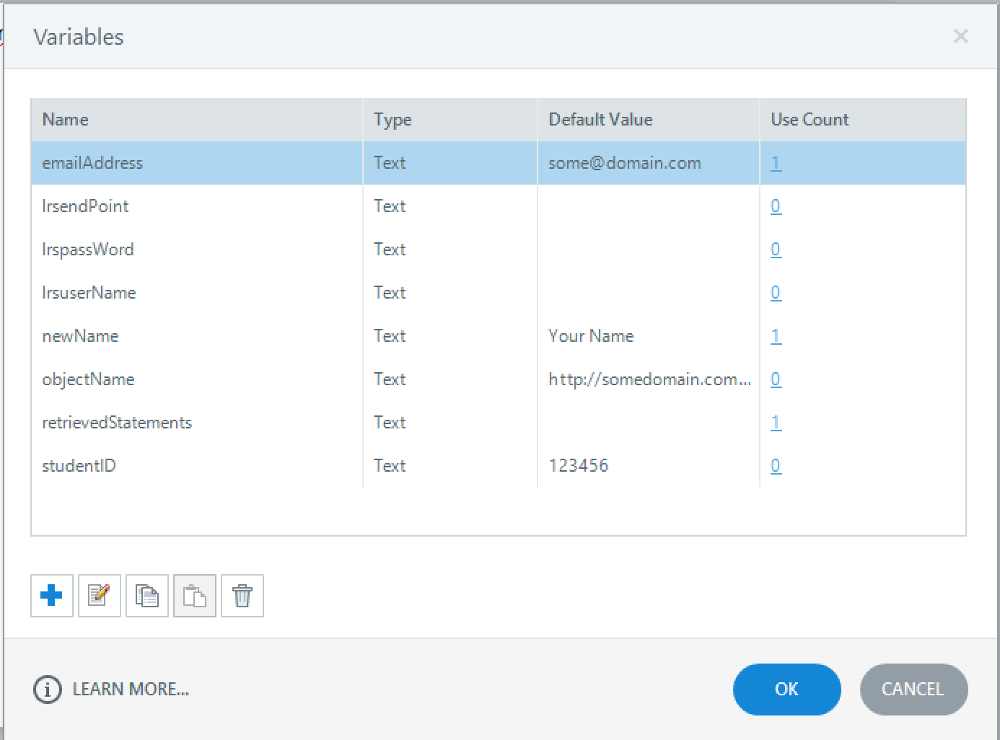

# xAPI-Storyline

### This script is a proof in concept that shows how to send an xAPI statement then retrieve it from the LRS and display portions as text in storyline.

Dependancies:  
[tincan.js](https://github.com/RusticiSoftware/TinCanJS) <br>
[Storyline2 or Higher](https://articulate.com/)

## Basic Instructions for use

1. Download and open [xapi-storyline.story](hxapi-storyline.story)
2. Edit LRS Variables with your LRS info: (leave other variables alone for now)
    * lrsendPoint
    * lrsuserName
    * lrspassWord
    
    
    
3. Save file and publish.
4. copy [xapi-storyline.js](xapi-storyline.js) into the story_content folder located in you published directory. 
5. Open story.html in text editor and add these lines to line 123.  (line 78 of story_html5.html)

```html
<script src="https://rawgit.com/RusticiSoftware/TinCanJS/master/build/tincan-min.js" type="text/javascript"></script>
<script src="story_content/xapi-storyline.js" type="text/javascript"></script>
```
6. View story.html or story_html5.html in browser.
7. Edit Name and Email address fields then hit send and recieve.

## Advanced Instructions for use

It is easy to alter the Verb and Object IRI when you send a statement by editing the "Execute Javascript" trigger. 
By default the trigger fires off this javascript Function.
```Javascript
sendStatements('interacted', 'http://activitystrea.ms/schema/1.0/interact', 'http://someproject.com/module1/page1/click_to_send');
```
To send a statement with an alternative verb and object all you would need to do is alter the parameters in the following manner
```javascript
sendStatements('verb', 'verbIRI', 'objectIRI');
```

To change the retrieval verb alter the verb IRI in this functions parameters with the verb IRI of your choice 
```Javascript
getStatements('http://activitystrea.ms/schema/1.0/interact')
```


```javascript
getStatements('verbIRI')
```
